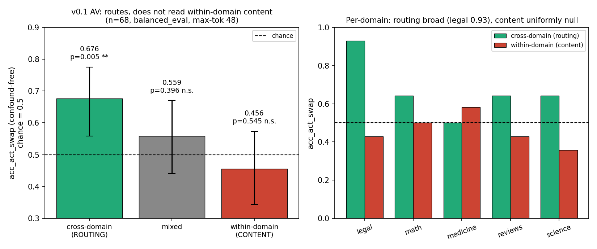
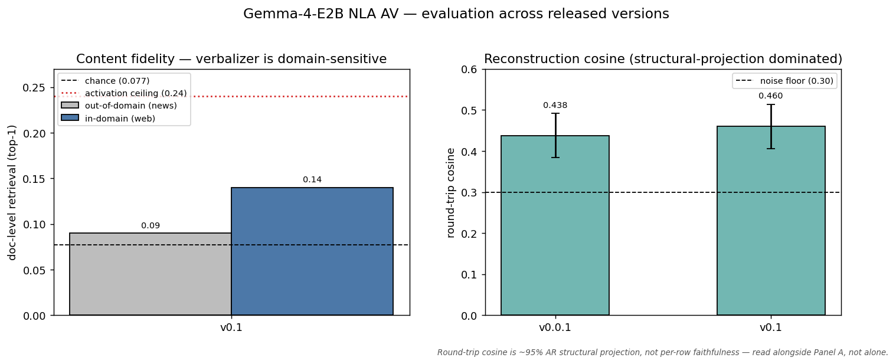
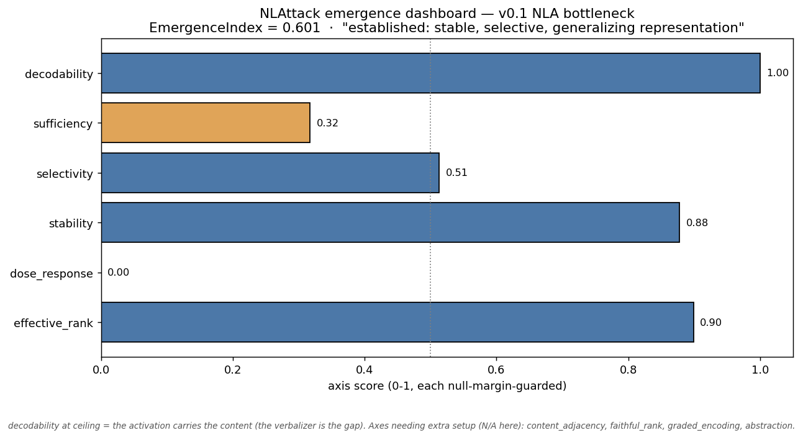

# Gemma-4-E2B NLA AV (Activation Verbalizer) — v0.1

LoRA adapter for `google/gemma-4-E2B` that takes a 1536-dimensional residual-stream activation captured at layer 23 and produces a natural-language explanation of what the activation represents.

This is the **first non-Anthropic-team open-source NLA Activation Verbalizer** released publicly. Trained end-to-end on a single 4 GB consumer GPU (NVIDIA GTX 1650 Ti Max-Q) following a **customized variation (see below)** of the methodology of Fraser-Taliente, Kantamneni, Ong et al. 2026 ([Transformer Circuits](https://transformer-circuits.pub/2026/nla/)).

### Customizations vs the source methodology
This release adapts the NLA recipe to consumer hardware and adds evaluation, so it is a *variation*, not a faithful reproduction:
- **Parameter-efficient + quantized, not full-fine-tune bf16:** a LoRA adapter (r=64 for v0.0.1, r=80 for v0.1) over a **4-bit NF4-quantized** frozen base, vs the source's full fine-tune. Loads in ~1.5 GB VRAM on top of the frozen base.
- **Consumer-scale training budget:** single 4 GB GPU, micro-batch 1 with gradient accumulation, a few hundred SFT steps — far smaller effective batch and step count than the source recipe.
- **Single-token activation injection:** a forward hook replaces one placeholder token's embedding with the L2-normalized activation rescaled to the embedding norm (√d_model ≈ 39.2), rather than the source injection scheme.
- **SFT-only released pair:** Phase-4 GRPO was explored separately and is **not** in the shipped pair (it did not beat the SFT pair at 4 GB).
- **Added evaluations beyond round-trip cosine:** content-specificity doc-level retrieval (lexical / semantic / LLM-judge), an in-domain-vs-out-of-domain domain-sensitivity analysis, an activation-ceiling probe, and a cross-version evaluation figure (above).

Pairs with the matched [`Solshine/gemma-4-e2b-nla-L23-ar-v0_1-paraphrase-invariant`](https://huggingface.co/Solshine/gemma-4-e2b-nla-L23-ar-v0_1-paraphrase-invariant) reconstructor.

## What this verbalizer reads from an activation (and what it does not)

A focused June 2026 evaluation pins down where v0.1's activation-conditioning is strong and where it is not. The test is a confound-free forced choice: fix the target text, swap only the injected activation, and ask whether the right activation makes its own text more likely than a wrong activation does. Because the scored text is identical on both sides, text length and perplexity cancel exactly, so the score isolates pure activation-conditioning. Chance is 0.5.



- **Across domains (routing): 0.676, p = 0.005.** Given two activations from different domains, the verbalizer reliably prefers the text matching the activation it was actually given. It tracks which domain an activation came from.
- **Within a domain (content): 0.456, at chance.** Given two activations from the same domain, it cannot tell them apart. It does not resolve which specific activation within a domain it is describing.
- The split holds across target lengths (16 / 32 / 48 tokens) and is uniform across all five test domains. Routing is broad and led by legal at 0.93; within-domain content is null everywhere.

**What this means in practice:** read v0.1's conditioning as a domain-level signal, not a fine-grained content readout. Its explanations track the broad topic of an activation much better than the specific feature within that topic. Narrowing this within-domain gap is the focus of ongoing work. (n = 68 held-out activations, balanced across legal, math, reviews, science, and medicine; confound-free forced-choice likelihood metric.)

## How to use

```python
from transformers import AutoModelForCausalLM, AutoTokenizer, BitsAndBytesConfig
from peft import PeftModel
import numpy as np
import torch

BASE = "google/gemma-4-E2B"
AV_REPO = "Solshine/gemma-4-e2b-nla-L23-av-v0_1_dd-step_250"

# Injection convention
INJECTION_TOKEN_ID = 249568           # ㊗
INJECTION_LEFT_NEIGHBOR_ID = 236813   # <
INJECTION_RIGHT_NEIGHBOR_ID = 954     # >
INJECTION_CHAR = chr(0x3297)
D_MODEL = 1536
INJECTION_SCALE = float(np.sqrt(D_MODEL))  # = 39.2; matches Gemma-4-E2B token-embed norm

PROMPT = (
    "You are a meticulous AI researcher conducting an important investigation "
    "into activation vectors from a language model. Your overall task is to "
    "describe the semantic content of that activation vector.\n\n"
    "We will pass the vector enclosed in <concept> tags into your context. "
    "You must then produce an explanation for the vector, enclosed within "
    "<explanation> tags. The explanation consists of 2-3 text snippets "
    "describing that vector.\n\nHere is the vector:\n\n"
    f"<concept>{INJECTION_CHAR}</concept>"
)

bnb = BitsAndBytesConfig(load_in_4bit=True, bnb_4bit_compute_dtype=torch.float16, bnb_4bit_quant_type="nf4")
tok = AutoTokenizer.from_pretrained(BASE)
base = AutoModelForCausalLM.from_pretrained(BASE, quantization_config=bnb, device_map="auto")
av = PeftModel.from_pretrained(base, AV_REPO); av.eval()

# At inference: hook the embedding layer to replace ㊗'s embedding with the
# scaled activation vector when the [<, ㊗, >] trio is detected.
pending = {"input_ids": None, "vec": None}
def hook(module, args_in, output):
    if output.shape[1] <= 1: return output
    ids = pending["input_ids"]; vec = pending["vec"]
    if ids is None or vec is None: return output
    h = output.clone()
    for b in range(ids.shape[0]):
        for p in range(1, ids.shape[1] - 1):
            if (ids[b,p].item() == INJECTION_TOKEN_ID
                and ids[b,p-1].item() == INJECTION_LEFT_NEIGHBOR_ID
                and ids[b,p+1].item() == INJECTION_RIGHT_NEIGHBOR_ID):
                h[b,p] = vec[b].to(h.dtype); break
    return h
av.get_input_embeddings().register_forward_hook(hook)

# Use
activation_vector = np.random.randn(D_MODEL).astype(np.float32)  # your 1536-d L23 activation
scaled = activation_vector / (np.linalg.norm(activation_vector) + 1e-9) * INJECTION_SCALE
ids = tok.encode(PROMPT, return_tensors="pt").to(av.device)
pending["input_ids"] = ids
pending["vec"] = torch.from_numpy(scaled).to(av.device).unsqueeze(0)

with torch.no_grad():
    out = av.generate(input_ids=ids, max_new_tokens=120, do_sample=False, pad_token_id=tok.eos_token_id)
print(tok.decode(out[0][ids.shape[1]:], skip_special_tokens=True))
```

Working end-to-end round-trip example with the matched AR: `examples/round_trip_example.py` in the [bundled public repo](https://github.com/SolshineCode/nla-gemma-4-e2b).

## Training setup

- **Base model**: `google/gemma-4-E2B` (2B parameters, 35 text layers)
- **Activation layer**: L23 residual stream
- **Quantization**: NF4 4-bit base weights + fp16 LoRA adapters
- **LoRA config**: r=80, α=128 (v0.1; v0.0.1 used r=64), target modules = `model.language_model.layers.\d+.(self_attn|mlp).(q_proj|k_proj|v_proj|o_proj|gate_proj|up_proj|down_proj)` (language-model layers only; excludes audio tower)
- **Injection mechanism**: forward hook on embedding layer; replaces ㊗ token's embedding with the L2-normalized activation rescaled to `injection_scale = sqrt(d_model) = 39.2` (matches the empirically-measured Gemma-4-E2B token-embedding norm of 39.25)
- **Optimizer**: AdamW 8-bit, lr=1e-4
- **Batch**: micro_batch=1, grad_accum=4 → effective batch 4
- **Max length**: 512 tokens
- **SFT steps**: 250 (this v0.1 AV is the step-250 checkpoint, `dd-step_250`; v0.0.1 used 55 total). A continuation past step 250 regressed on the held-out content-retrieval trajectory, so step 250 is the released checkpoint.
- **Hardware**: single 4 GB NVIDIA GTX 1650 Ti Max-Q (laptop)
- **Training corpus**: (text, L23 activation, LLM-labeled explanation) triples from the same consumer-GPU NLA pipeline that produced v0.0.1 (2,548 triples on the v0.0.x baseline)

## Headline numbers (v0.1)

- **Round-trip cosine** (paired with [`Solshine/gemma-4-e2b-nla-L23-ar-v0_1-paraphrase-invariant`](https://huggingface.co/Solshine/gemma-4-e2b-nla-L23-ar-v0_1-paraphrase-invariant)): **0.460**, above the 0.30 noise floor (v0.0.1 round-tripped at 0.438 ± 0.054 on n=42 effective held-out activations). See the cross-version figure below.
- **NLAttack EmergenceIndex** on the held-out deception-domain bottleneck: **0.601** ("established: stable, selective, generalizing representation"), driven by decodability = 1.00 and stability = 0.88 (see the NLAttack section below).

## Evaluation across released versions



Content-fidelity doc-level retrieval (left) and reconstruction round-trip cosine (right) across the
released AV versions. The verbalizer's content-surfacing is domain-sensitive: at chance on
out-of-domain news, modestly but significantly above chance in-domain (see Limitations). Round-trip
cosine is shown with the caveat that it is structural-projection dominated, not a faithfulness
metric. Regenerate with `make_nla_eval_figure.py` as new versions or evaluations land.

## NLAttack capability-floor evaluation



Beyond round-trip cosine and doc-retrieval, this release was run through the [NLAttack](https://github.com/SolshineCode/NLAttack) capability-floor harness — a battery of concept-survival and emergence tests that probe what the NLA's information bottleneck actually carries, independent of whether the verbalizer surfaces it in text. The figure above is NLAttack's emergence dashboard: nine axes, each scored against its own permutation null, combined into a single EmergenceIndex.

On a held-out deception-domain eval set the v0.1 bottleneck scores **EmergenceIndex 0.601 — "established: stable, selective, generalizing representation."** The two highest axes are the load-bearing ones:

- **decodability = 1.00** (raw AUC 0.993 vs 0.50 null). A linear probe reads the injected concept off the residual activation at ceiling. The content is in the activation.
- **stability = 0.88** (margin 0.86). The probe direction holds across resampling seeds, so the signal is a real representation, not a single-seed artifact.
- **selectivity = 0.51** and **effective_rank = 0.90** are moderate-to-strong: the representation is concept-specific rather than a frequency/length confound, and it spreads across a usable number of dimensions.
- **sufficiency = 0.32** and **dose_response = 0.00** are weak: the activation barely beats a trivial input feature on a downstream task, and probe accuracy does not track training prevalence.

The read is consistent with this release's headline limitation. The bottleneck is good — the concept survives the activation at near-perfect linear decodability and high stability — and the open problem is the verbalizer half, which does not reliably turn that decodable content into descriptive text. NLAttack quantifies the "content is present in the activation, not yet surfaced by the AV" finding as a capability floor rather than an accuracy claim.

Four axes (content_adjacency, faithful_rank, graded_encoding, abstraction) need additional setup — hard-negative minimal pairs, AR reconstruction in the loop, and multi-context pooling — and are not scored here; they are deferred to a later run. The general-domain pass with NLAttack's broad concept pool fell below the harness's eight-concept reliability floor on our held sets, so the scored result above is on the deception-domain set where concept coverage was sufficient. Regenerate with `make_nlattack_v01_figure.py` after a fresh NLAttack run.

## What makes this release distinctive

- **First non-Anthropic-team open-source NLA AV** at any model scale. As of 2026-05, every other NLA on HuggingFace Hub is under the `kitft` account (Kit Fraser-Taliente, the paper's first author and Anthropic's official reference). This pair is the second-source replication.
- **First LoRA-based NLA AV.** Anthropic's published NLA AVs are full fine-tunes at bf16. This release demonstrates that a **LoRA adapter (r=80, α=128 for v0.1)** over NF4-quantized Gemma-4-E2B can train the AV half of an NLA pair to the same output FORMAT class (fluent multi-paragraph descriptive text) at 13× smaller parameter scale. Per-row content fidelity is lower than Anthropic's deployed NLAs, though a ceiling test shows that content is present in the activation (60% linear probe on 13-way document identity) and simply not yet surfaced by the verbalizer rather than absent — see "Limitations" below for the head-to-head and the activation-ceiling result. Shipping as a LoRA adapter means the AV loads in ~1.5 GB VRAM on top of the frozen NF4 base, vs ~12 GB for a full bf16 AV.
- **Consumer-GPU trainable.** End-to-end training fits on a 4 GB laptop GPU because of the LoRA + NF4 stack. The methodology descope (NF4 + LoRA + small corpus + ≤300 SFT steps vs Anthropic's full bf16 fine-tune on 8–64 H100s) is documented per parameter.
- **Full open reproducibility chain** in the bundled repo: Stage 0 (extraction) → Stage 1 (split) → Stage 2 (LLM-judge labeling) → Stage 3 (training-format build) → SFT → eval.

## Release rationale: why this SFT pair and not a GRPO checkpoint

The Anthropic NLA recipe (Fraser-Taliente et al. 2026) has four phases: Stages 0–3 (data + labeling) → SFT (supervised fine-tune of the AV+AR pair) → **Phase 4 GRPO** (joint REINFORCE-style RL fine-tune of the AV with the AR's reconstruction-MSE as reward signal, plus an AR "keep-up" SFT update and a KL anchor). The published `v0.0.1` and `v0.1` pairs are the **SFT-only** output of Phases 1–3; Phase 4 GRPO was deferred at first release because it had not yet been adapted to the 4 GB hardware regime.

Between 2026-05-25 and 2026-05-29 the deferred Phase 4 was implemented and run **end-to-end on the same 4 GB GTX 1650 Ti Max-Q**, with alternating AV/AR loads and R=4 rollout batching to fit in VRAM. The trial swept **5 reward formulations × 4 entropy regimes across 120 rollouts**, with intermediate L2 cross-row-argmax readouts at rollouts 40, 60, 80, 100, 120:

| Rollout | Reward | Entropy β | L2 cross-row argmax (n=10) | AV output quality |
|---:|---|---:|---:|---|
| 40 | MSE | 0.0 | 0.100 (chance) | coherent multi-paragraph (same class as SFT v0.1) |
| 60 | MSE | 0.3 | 0.100 (chance) | random Unicode tokens — degenerate |
| 80 | contrastive-mean | 1.0 | 0.100 (chance) | whitespace-only — degenerate |
| 100 | contrastive-max | 1.0 | 0.100 (chance) | "evasion evasion evasion …" mode collapse |
| 120 | contrastive-max + AR-contrastive | 0.1 | 0.100 (chance) | "evasion evasion evasion …" mode collapse |

**Verdict.** No GRPO checkpoint is shipped:
- **r40** (the only checkpoint with intact AV-output coherence) matched the SFT v0.1 L2 margin within noise — it did not beat the released SFT pair on the headline metric, so shipping it would add nothing.
- **r60–r120** (all higher-entropy configurations) produced AV output that is unusable for any downstream consumer of the NLA — random tokens, whitespace, or the "evasion" attractor. These checkpoints are research-valuable but unfit to ship as an interpretability tool.

**The released SFT pair is strictly better than any GRPO checkpoint we produced on this hardware**: both classes are at L2 = chance on per-row identity, but the released SFT pair preserves the coherent multi-paragraph descriptive output that gives the NLA pipeline its interpretability surface, whereas the high-entropy GRPO checkpoints destroyed that surface without compensating with any measurable per-row-fidelity gain.

**Research contribution.** This trial closed the scope of the SFT-only "ceiling" framing: combining the 8-attempt SFT lever sweep with the 5-readout GRPO sweep yields **14 distinct training attempts spanning the full Anthropic recipe**, all converging to L2 = chance at 4 GB. The L2 ceiling at this hardware scale is therefore robust to (a) optimizer-/loss-/scheduler-side levers within SFT, (b) reward shape (MSE vs contrastive vs contrastive-max), (c) entropy regularization (β ∈ {0, 0.1, 0.3, 1.0}), and (d) training paradigm (SFT-only vs SFT+GRPO). The open question — whether the bottleneck is **base-model scale** (2B vs 27B/70B) or **the 4 GB hardware constraint** (NF4 + LoRA + small contrast pool) — would be answered by a cross-model recipe-controlled retrain on Gemma-3-27B; that experiment is flagged for follow-on grant-funded work.

The v0.0.1 + v0.1 SFT pair on this repo therefore represents the **best-coherent-output checkpoint** from a comprehensive characterization of the Anthropic NLA recipe at 4 GB, **not** a checkpoint that ran out of training budget before further phases could be attempted.

## Limitations

**NLAs can produce unexpected or incorrect explanations.** Specifically for this release:

- **Fluent multi-paragraph descriptive output, with lower per-row content fidelity than Anthropic's deployed NLAs.** The AV produces well-formed paragraph-length descriptions in the same FORMAT class as Anthropic's published NLAs. On a 10-row head-to-head against Anthropic's Gemma-3-27B Layer 41 NLA via the Neuronpedia API, Anthropic's NLA more accurately names specific people / events / topics (e.g. "Hillary Clinton's primary momentum", "Obama and Obamacare") where this AV produces more generic linguistic-feature descriptions (e.g. "country-specific statistical weights", "non-binary identity"). The format match is real; per-row content fidelity is meaningfully lower. A direct content-specificity retrieval eval (does each AV output recover its own source document?) puts this AV **at chance on out-of-domain text** (politically-themed news, a genre absent from training) across lexical, semantic, and two LLM-judge probes, so on that distribution the output is diverse (45/50 unique strings) but not per-row content- or theme-discriminative. The picture is **domain-sensitive**, though: on held-out **in-domain** text (web text of the kind represented in training), the same AV recovers its own source document modestly but significantly **above chance** — doc-level retrieval ≈ 2× chance (n=50 / 13 docs: 0.14 vs 0.077, p≈0.08; confirmed at n=160 / 40 docs: 0.056 vs 0.025 lexical, p=0.01, and 0.050 vs 0.025 semantic, p=0.03), with some genuinely content-bearing outputs (e.g. naming "1919 Paris Peace Conference" or "filmmaker Nanfu Wang"). One important nuance keeps this honest: a blind reasoning-LLM judge still cannot identify the true source above chance (n=38), so this in-domain advantage reflects **occasional exact content-word surfacing, not systematic conditioning** on the activation — the AV surfaces source content sometimes in-domain and falls back to a learned prior out-of-domain. Importantly, the gap is the verbalizer's, not the activation's: a ceiling test on the raw L23 activations recovers the source document well above chance (doc-level retrieval 0.24 vs 0.077; a logistic probe reads 13-way document identity at 60%), so the content the AV does not yet surface is demonstrably present in the activation. That places the bottleneck in the verbalizer's reading of the injected activation rather than in the 2B model's content — an open problem under active investigation, not a settled matter of training budget — and a layer sweep finds L17 carrying more than 2× the document signal of L23, a lever a future AV can retarget. Comparison data, retrieval-eval scripts, and per-trial LLM-judge data are in the bundled repo under [`experiments/v8_nla_local/`](https://github.com/SolshineCode/nla-gemma-4-e2b/tree/main/experiments/v8_nla_local) (`CONTENT_SPECIFICITY_EVAL.md`).
- **Round-trip cosine has a structural-projection component.** Replicating the published §"Measuring steganography" and §"Characterizing confabulations" tests on v0.0.1: paraphrasing the AV output moves the round-trip cosine by ~3% (Δcos = +0.014); removing entire claims from the AV output moves cosine by ~0% per claim (Δcos = +0.001 per claim). Most of the v0.0.1 round-trip-cosine signal is the AR's structural projection toward "somewhere in OpenWebText L23 activation space," not the explanation's specific content. **Use AV-side per-row content-fidelity judging (validity × specificity × relatedness rubric) alongside round-trip cosine, never round-trip cosine alone.**
- **Template-heavy outputs.** Inspection shows ~80% of held-out-row outputs share a small set of structural templates with content-conditional fill-in slots. Use multiple feature angles + content-judge scoring rather than treating any single output as a verbatim summary of the activation.
- **Hardware-bound quality ceiling.** Numbers reflect a single 4 GB GTX 1650 Ti Max-Q. Larger consumer GPUs with bf16 + full fine-tune + larger corpus would close some of the qualitative gap with the published reference NLAs.

Full development history and methodology retraction notes: [`HISTORY.md`](https://github.com/SolshineCode/nla-gemma-4-e2b/blob/main/HISTORY.md). Internal experiment numbering and audit trail: source research repo (available on request).

## Sidecar (training provenance YAML)

The companion `nla_meta.yaml` records training-time hyperparameters for round-tripping at inference. Read `injection_scale` from this file rather than hardcoding to avoid train-test mismatches.

## Citation

```bibtex
@article{frasertaliente2026nla,
  title={Natural Language Autoencoders},
  author={Fraser-Taliente, Kit and Kantamneni, Kshitij and Ong, Antonia and others},
  journal={Transformer Circuits},
  year={2026},
  url={https://transformer-circuits.pub/2026/nla/}
}

@misc{deleeuw2026nlagemma4e2bav,
  title={Gemma-4-E2B NLA AV (v0.1): a 4 GB consumer-GPU Activation Verbalizer},
  author={DeLeeuw, Caleb (SolshineCode)},
  year={2026},
  url={https://huggingface.co/Solshine/gemma-4-e2b-nla-L23-av-v0_1_dd-step_250}
}
```

## License

CC-BY 4.0. See [`LICENSE`](LICENSE) in the bundled repo.
