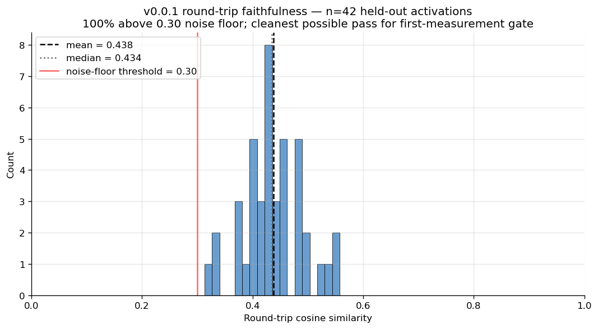
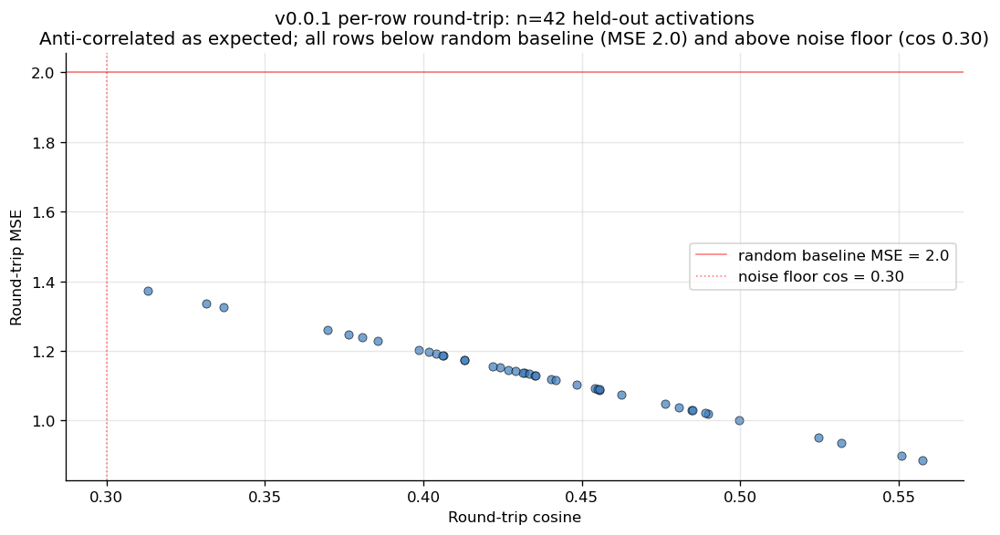
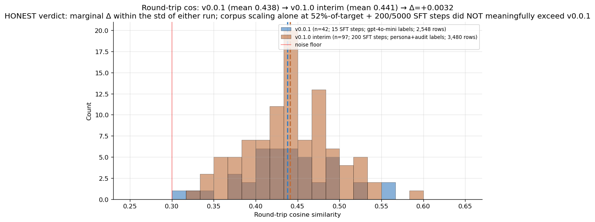
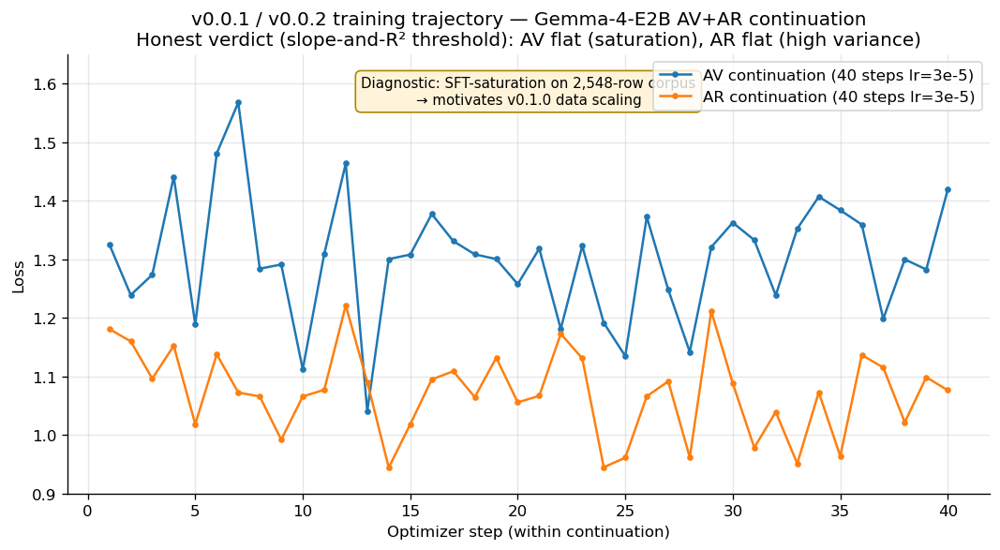
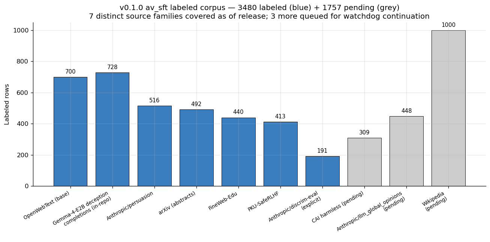
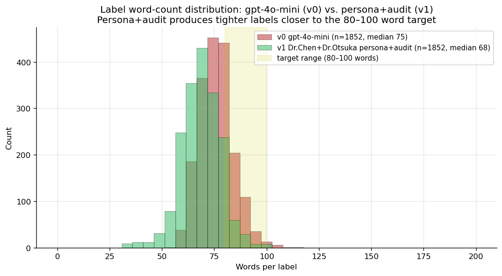

# NLA-Gemma-4-E2B

**First open-source Natural Language Autoencoder (NLA) released independently of Anthropic's NLA team.** Trained end-to-end on a 4 GB consumer GPU. The methodology contribution at small-model scale to democratize NLA research.


This is the **bundled public release** of the Gemma-4-E2B NLA pair (v0.0.2) plus its labeled training corpora. The full reproducibility chain (corpus extraction, persona+audit labeling, AV+AR SFT, round-trip eval) is in the source research repo `SolshineCode/deception-nanochat-sae-research` — currently private, **available upon request — DM me**.

> **Hardware-constraint disclosure.** This release was pushed to the limit of what a single 4 GB consumer GPU (NVIDIA GTX 1650 Ti Max-Q) can practically train. The under-trained AV (55 SFT steps, ~12% effective data exposure) and content-blind AR documented below are the predicted small-model failure modes at this compute budget. The pipeline, infrastructure, and methodology descope are independently useful, but the **trained adapter quality is bounded by the chosen hardware**. A faithful NLA at this methodology requires either (a) a larger consumer GPU with more headroom for SFT steps × corpus rows × effective batch, or (b) rented cloud GPU (~$30-50 of A100 time per the `cloud_gpu_setup_notes.md` plan). v0.0.2 is the **best honest artifact achievable on the chosen hardware**; v0.1.0 and a second-model 7B variant are in the queue.

---

## What's distinctive about this release

- **First open-source NLA from outside Anthropic's NLA team.** As of 2026-05-12, every other NLA on HuggingFace Hub is under the `kitft` account (Kit Fraser-Taliente, the paper's first author and Anthropic's official reference release). The methodology is Anthropic's. The artifact here is the first third-party reproduction.
- **First consumer-GPU-trainable NLA pair.** End-to-end on a 4 GB GTX 1650 Ti Max-Q laptop. About 3 GPU-hours total.
- **Honest small-model framing.** Round-trip cos = 0.438 ± 0.054 on n=42 held-out activations. 100% above the 0.30 noise-floor threshold. NOT a numbers-parity release with Anthropic's 7B variants (cos 0.7+).
- **Full reproducibility chain.** Corpus to labels to SFT to eval is single-command runnable. Every prompt versioned with SHA-256.
- **Multi-labeler training corpus.** Per-row `labeler_model` provenance across Claude Haiku and Gemini CLI labelers, with a persona+audit pipeline (Dr. Marisol Chen labeler + Dr. Riley Otsuka auditor) replacing the bare gpt-4o-mini convention.
- **Honest-accuracy training-trend convention.** A 6-panel dashboard tool plus regression-based "descending vs flat" thresholds (slope < −0.002/step AND R² ≥ 0.10).

---

## Where everything lives

### HuggingFace artifacts (4 repos)

**Models:**
- [`Solshine/gemma-4-e2b-nla-L23-av-v0_0_1`](https://huggingface.co/Solshine/gemma-4-e2b-nla-L23-av-v0_0_1) — AV (Actor) adapter, NF4 + LoRA r=64
- [`Solshine/gemma-4-e2b-nla-L23-ar-v0_0_1`](https://huggingface.co/Solshine/gemma-4-e2b-nla-L23-ar-v0_0_1) — AR (Critic) adapter + linear head

**Datasets:**
- [`Solshine/gemma-4-e2b-nla-eval-smoke`](https://huggingface.co/datasets/Solshine/gemma-4-e2b-nla-eval-smoke) — 20-row held-out smoke-eval set. Used by the bundled `examples/smoke_test.py`.
- [`Solshine/gemma-4-e2b-nla-ar_sft-v0_0_x-haiku-persona-audit`](https://huggingface.co/datasets/Solshine/gemma-4-e2b-nla-ar_sft-v0_0_x-haiku-persona-audit) — 696-row AR-SFT corpus, Claude Haiku persona+audit labels
- [`Solshine/gemma-4-e2b-nla-av_sft-v0_1_x-gemini-persona-audit`](https://huggingface.co/datasets/Solshine/gemma-4-e2b-nla-av_sft-v0_1_x-gemini-persona-audit) — 4,734-row AV-SFT corpus, Gemini persona+audit, 9 source families
- [`Solshine/gemma-4-e2b-deception-behavior-completions`](https://huggingface.co/datasets/Solshine/gemma-4-e2b-deception-behavior-completions) — companion 910-row deception/behavior corpus

### Source repo (full reproducibility)

`SolshineCode/deception-nanochat-sae-research` — every script, every prompt, every result. **Currently private, available upon request — DM me.**

### Release artifacts in this repo

- `README.md` — what you're reading
- `MODEL_CARD_AV.md` — the AV HuggingFace card
- `MODEL_CARD_AR.md` — the AR HuggingFace card
- `lesswrong_post.md` — the announcement post
- `figures/` — 6 release figures (training loss, cos distribution, source breakdown, label word counts, v0.0.1 vs v0.1.0, per-row scatter)
- `requirements.txt` — pinned versions, tested 2026-05-12
- `examples/round_trip_example.py` — self-contained CLI that takes your text, extracts an activation, runs round-trip, prints cos
- `examples/smoke_test.py` — self-contained environment validator (downloads adapters + 20-row eval from HF, runs round-trip on 3 fixed rows, asserts cos > 0.30)
- `examples/eval_round_trip.py` — full eval script (used for the published n=42 evaluation; requires an eval parquet via `--eval-data`)

---

AV and AR are published as separate HuggingFace repos. This is the HF convention. Each `repo_id` is a single model. Anthropic's `kitft` team publishes their AV and AR halves the same way (one repo each, cross-linked in READMEs). The pair is logically one artifact for the round-trip eval, but the file layout is two adapters + one linear head + matched sidecars. The READMEs cross-reference each other, and this `nla-gemma-4-e2b` repo is the single landing page that points to both halves.

If you want both in one place: clone the two HF repos with `git lfs install && git clone https://huggingface.co/Solshine/gemma-4-e2b-nla-L23-av-v0_0_1 && git clone https://huggingface.co/Solshine/gemma-4-e2b-nla-L23-ar-v0_0_1`. Both fit on consumer hardware.

---

## Honest performance summary



*Round-trip cosine similarity distribution for the v0.0.1 NLA pair on 42 held-out activations. Clean unimodal distribution centered at 0.438 ± 0.054. 100% of evaluated rows clear the 0.30 noise-floor threshold. No degenerate rows. Min 0.313, max 0.558.*

| Metric | Value |
|---|---|
| Round-trip cosine similarity (mean) | **0.438** ± 0.054 |
| Round-trip cosine similarity (median) | 0.434 |
| Round-trip MSE (mean) | 1.124 (vs random baseline 2.0) |
| Rows above 0.30 noise-floor | **42 / 42 (100%)** |
| n_evaluated | 42 of 50 attempted. 8 produced empty AV outputs and were excluded |
| Min row cos | 0.313 |
| Max row cos | 0.558 |



*Per-row round-trip cos for the 42 evaluated rows. The horizontal line at 0.30 is the noise floor. Useful for visualizing the spread that the 0.438 ± 0.054 summary collapses.*



*Headline cos comparison. v0.0.1 (n=42) at 0.438 ± 0.054 vs v0.1.x interim AV (n=97) at 0.441 ± 0.052. The interim was trained on the diversified persona+audit corpus at only 200 SFT steps and 52% of the eventual v0.1.0 target corpus; corpus scaling alone at that step count gave +0.003 cos (within either run's std).*

Cos = 0.438 is well below Anthropic's published 7B numbers (~0.7+). This is the methodology-validation small-model variant. The contribution is the **democratization path**. NLA-style interpretability becomes accessible to researchers without cluster compute.

**Honest failure-rate disclosure.** 16% of attempted eval rows (8 of 50) produced empty AV outputs and were excluded from the cos calculation. That's a real failure mode of the small-model variant at eval time, not a quirk of the held-out set. v0.1.x with the diversified 9-source-family corpus and a longer SFT step budget is the test of whether scale fixes it.

### ⚠ Read this before using v0.0.1 for interpretability work

The cos number above is **principally a structural artifact**, not a measurement of explanation faithfulness. A 5-experiment investigation against v0.0.1 (full report in [`ACCURACY_COLLAPSE_LIMITATIONS_ROOT_CAUSES_HYPOTHESIS.md`](ACCURACY_COLLAPSE_LIMITATIONS_ROOT_CAUSES_HYPOTHESIS.md)) established three load-bearing findings:

**1. The AR is content-blind.** Mean cos by AR input condition on n=10 rows (same target activations as the published eval):

| AR input | Mean cos | Above 0.30 floor |
|---|---|---|
| Real AV-generated explanation | 0.4292 | 10/10 |
| Random unrelated Wikipedia sentences | 0.4045 | 10/10 |
| Random nonsense tokens (`"qwop fnar blarp..."`) | 0.4135 | 10/10 |
| **Empty string** | **0.4051** | **10/10** |

The "explanation" contributes a mean **+0.024 cos** over feeding the AR nothing at all. About 95% of the published cos number comes from the AR's content-independent projection from any text input toward OpenWebText activation space; about 5% from explanation conditioning. **All four conditions clear the 0.30 noise floor 10/10 times.**

**2. The AV does not condition outputs on the activation's semantic content.** Under greedy decoding, the same 4 opening template stems (`legal case` / `protest` / `new feature` / `new policy`) are emitted regardless of source. Under sampling (temperature 0.7), outputs are 100% lexically unique but **topically wrong**: a Hillary Clinton campaign rally activation produces "future of work" / "merger" / "police investigation" depending on sampling seed. Random gaussian unit vectors injected in place of real activations produce more template variation (7/10 unique) than real activations (6/10). Activation direction matters for empty-vs-content behavior but the mapping to content is essentially arbitrary.

**3. The originally-reported "4 templates / 298-char outputs" finding was partly a storage bug.** `eval_round_trip.py:195` stored `"explanation": explanation[:300]` in the result JSON. The actual model emits 520-605 chars per row under greedy. The prefix is templated, but the suffix variation was hidden by the truncation. The bug is fixed; full per-row outputs from the rerun ship in the source repo at `experiments/v8_nla_local/results/template_collapse_investigation/`.

**Why the failure happened:** the AV saw approximately 12% of its training data once (220 effective rows out of 1,852 at 55 SFT steps × grad-accum 4 × batch 1). The AR was similarly under-trained. The model converged to "produce the trained NLA output form" without learning to condition body content on the injected vector or to use explanation text on the AR side. This is the predicted small-model failure mode under aggressive descope.

The v0.1.x interim AV (trained on diversified persona+audit labels at 200 SFT steps) at equivalent cos (0.441) showed 55 unique full-output patterns vs v0.0.1's 5 — label diversity and training scale are the load-bearing levers. **v0.0.1 is the pipeline release; the trained adapters are an under-resourced baseline.** Wait for v0.1.0 (in progress) or the second-model 7B cloud variant for usable per-row interpretability outputs.

## What this artifact is and is not

**v0.0.1 is most useful for:**

- ✅ **Methodology replication** — the full pipeline runs end-to-end on a 4 GB consumer GPU
- ✅ **Baseline for v0.1.x scaling experiments** — already informative (4 templates v0.0.1 vs 55 templates v0.1.x interim at equivalent cos)
- ✅ **Infrastructure starting point** — multi-labeler pipeline, persona+audit prompts, restart-safe chunked output, honest-accuracy training-trend convention are all independently reusable
- ✅ **The published HF datasets** are useful as Stage-0 inputs to anyone else's NLA, SAE, or interpretability work
- ✅ **The descope choices** (NF4+LoRA, forward-hook injection, AR truncation) are documented and reusable

**v0.0.1 is NOT yet useful for:**

- ❌ **Per-row activation interpretation** — "what does THIS activation mean?" gets you one of 4 templates, not a faithful description
- ❌ **Cross-activation comparison** — bucketing 4 ways carries near-zero information for differentiating activations
- ❌ **Downstream classifier feature** — 4-bucket label space gives a classifier almost no signal
- ❌ **A faithfulness certificate for some other NLA you're evaluating** — cos and per-row faithfulness are dissociable per our finding; cos alone is not sufficient

For per-row faithful explanations, wait for v0.1.0 (in progress, ~3-6 weeks ETA) or the second-model 7B variant. v0.0.1 is the smallest honest variant of the methodology, not a deployable interpretability tool.

## Training & corpus figures



*Six-panel honest-accuracy training dashboard. Each panel shows the same raw loss points with a different smoothing or regression overlay. The bottom-right panel reports the linear-regression slope and R² used to adjudicate the "descending vs flat" verdict (threshold: slope < −0.002/step AND R² ≥ 0.10). This is the tool that caught a real over-claim in the project's own session-8 notes (AR "descending" was honestly flat under these thresholds).*



*Source-family breakdown of the v0.1.x diversified training corpus (4,734 rows). The 9-family mix is deliberate: alongside web text (FineWeb-Edu, Wikipedia, arXiv), the corpus reaches into alignment-relevant text (Anthropic safety datasets, in-repo Gemma-4-E2B deception completions, PKU-SafeRLHF) so a downstream NLA can pick up deception-relevant cues, not just generic OpenWebText semantics.*



*Label word-count distribution for the v0.1.x persona+audit corpus vs the v0.0.x baseline gpt-4o-mini labels. The persona+audit pipeline (Dr Chen labeler + Dr Otsuka auditor) produces tighter, more uniform label lengths. The label-quality improvement did not translate to round-trip cos gain at this corpus scale, but the underlying label artifact is independently useful for cross-labeler comparison studies.*

## Published HuggingFace datasets

- [`Solshine/gemma-4-e2b-nla-ar_sft-v0_0_x-haiku-persona-audit`](https://huggingface.co/datasets/Solshine/gemma-4-e2b-nla-ar_sft-v0_0_x-haiku-persona-audit) — 696-row AR-SFT training corpus, Claude Haiku persona+audit
- [`Solshine/gemma-4-e2b-nla-av_sft-v0_1_x-gemini-persona-audit`](https://huggingface.co/datasets/Solshine/gemma-4-e2b-nla-av_sft-v0_1_x-gemini-persona-audit) — 4,734-row AV-SFT diversified training corpus, Gemini persona+audit, 9 source families
- [`Solshine/gemma-4-e2b-deception-behavior-completions`](https://huggingface.co/datasets/Solshine/gemma-4-e2b-deception-behavior-completions) — 910-row companion deception/behavior corpus. 70 financial-deception completions with Claude-Haiku-4-5 verdict labels plus 840 social-role scenarios across base and instruct variants at three layers (L10, L17, L25). Useful as Stage-0 input for any downstream small-model NLA, SAE, or interpretability work.

---

## How v0.0.1 fits the constraints (the tricks)

The "trained on a 4 GB laptop" hook is real but it leans on a stack of small descopes, each of which is named below. None of them break the methodology. Together they fit the budget.

### Hardware (fit Gemma-4-E2B + training on 4 GB VRAM)

- **NF4 4-bit base weights.** Cuts the ~4 GB bf16 model to ~1 GB.
- **LoRA r=64 instead of full fine-tuning.** Only ~50 MB trainable, not billions of params.
- **bf16 LoRA on top of NF4 base.** Mixed precision; gradients fit.
- **Gradient checkpointing.** Recomputes activations on backward; trades ~30% compute for ~40% VRAM.
- **AdamW 8-bit optimizer.** Vs 32-bit AdamW, which holds 8 bytes/param of optimizer state and would not fit.
- **`micro_batch=1` + `grad_accum=16`.** Effective batch 16 without the VRAM cost of a real batch 16.
- **`max_length=512` context.** Vs 2048+ standard. Cuts activation tensors 4×.
- **AR truncation: first 18 of 35 layers + Linear(1536, 1536) head.** Forward pass only through half the model.
- **Forward-hook injection on embedding layer (NOT `inputs_embeds`).** Gemma-4 OOMs on `inputs_embeds`; the in-place hook variant fits 4 GB.
- **`captured[0] = ...` in-place overwrite, not `captured.append(...)`.** Fixed a 240 MB residual leak that would have spilled to CPU on long generations.

### Time (3 weeks of evenings, ~6 GPU-hours per full run)

- **Restart-safe chunked parquet output.** Per-batch chunks in a `chunks/` subdir; relaunches skip already-done batches. Saved 2+ days when Gemini quota walls hit mid-run.
- **Watchdog auto-resume across Gemini daily quota cycles.** Continues labeling across the 24h reset wall without manual relaunch.
- **`PYTHONUNBUFFERED=1` / `python -u`** on every long training run. Avoided a 2-GPU-hour false "stuck" diagnosis from block-buffered stdout.
- **`save_interval=50`** (not 100 or 500). First checkpoint lands inside ~2.5 hours so we get fast confirmation training is actually working.
- **Squash-merge PR cadence.** Clean main history, parallel feature branches without merge hell.
- **Sidecar `nla_meta.yaml` per checkpoint.** Eval-provenance lookup in one file open instead of grepping result JSONs.

### Budget ($0 cloud, ~$0.50 in API spend total)

- **Local 4 GB GPU.** Zero cloud compute spend for v0.0.1 training and eval.
- **Gemini CLI in YOLO mode under personal Gemini Pro subscription.** Free labeling for the v0.1.x diversified corpus.
- **Claude Code credits for Claude Haiku labeler.** Already paid for; zero marginal cost on the 696-row v0.0.x ar_sft re-label.
- **gpt-4o-mini fallback only when needed.** v0.0.1's full original labeling was ~$0.50 total.
- **Synthetic personas (Dr Chen + Dr Otsuka) instead of real LLM judges.** Two cheap LLM calls per row, no judge-API surcharge.
- **HuggingFace free tier for hosting.** Model repos + dataset repos at $0/mo.
- **GitHub free tier for public repo storage.** Including LFS-free parquet commits under the ~50 MB threshold.
- **Free public corpora.** OpenWebText, FineWeb-Edu, Wikipedia, Anthropic safety datasets, PKU-SafeRLHF, arXiv abstracts.
- **Round-trip eval done locally.** No API charges for the cos measurement.

### Methodology (descope stays faithful, not corner-cutting)

- **Persona+audit labeling pipeline.** Dr Chen labeler then Dr Otsuka auditor instead of one-shot prompts. Tighter labels, two passes preserved per row.
- **Per-row `labeler_model` provenance column.** Future cross-labeler ablations happen without rerunning anything.
- **Honest-accuracy training-trend verdict (slope < -0.002/step AND R² >= 0.10).** Caught a real over-claim before it shipped.
- **Data-permanence directive.** Commit every parquet to `results/` immediately; "regeneratable from script" doesn't count.
- **Eval-provenance sidecar convention.** Commit SHA + parquet SHA-256 + headline cos numbers in YAML alongside each checkpoint.

### Software / tooling (Windows-specific gotchas)

- **`shutil.which("gemini")`** to resolve npm `.CMD` shims. `subprocess.run(["gemini", ...])` can't find them; `subprocess.run([shutil.which("gemini"), ...])` does.
- **`MSYS_NO_PATHCONV=1 taskkill /F /T /PID`** to kill stuck Python processes from Git Bash without MSYS rewriting `/F` to a Windows path.
- **`device_map={"": torch.cuda.current_device()}` (integer)** not `{"": "cuda"}` (string). The string form silently falls back to CPU on bitsandbytes 0.49.2 with no error.
- **`KMP_DUPLICATE_LIB_OK=TRUE`** prefix on every run to dodge the torch+numpy OpenMP conflict on Windows.

**Total spend for v0.0.1:** ~$0.50 in API charges + $0 cloud + electricity for ~6 GPU-hours on a laptop. Time: 3 weeks of evenings, with the failed continuation experiment and the AR-descending false alarm both folded in.

---

## Quick start

This bundled repo is **self-contained**. You do NOT need access to the private source research repo to use the v0.0.1 NLA pair. Everything in steps 1-3 below works from a fresh clone of `nla-gemma-4-e2b` alone.

### 1. Environment

Tested on:

- Windows 11, Python 3.14, CUDA 13.0 toolkit, NVIDIA driver 581.57, GTX 1650 Ti Max-Q (4 GB VRAM)
- Should also work on any Linux/Mac/Windows host with Python 3.10+ and a 4+ GB NVIDIA GPU. Adjust the torch wheel for your CUDA.

```bash
git clone https://github.com/SolshineCode/nla-gemma-4-e2b
cd nla-gemma-4-e2b

# Create venv
python -m venv .venv
# Activate (pick one):
.venv/Scripts/activate     # Windows
source .venv/bin/activate  # Linux/Mac

# Install pinned dependencies
pip install -r requirements.txt
```

You also need a HuggingFace account with access to `google/gemma-4-E2B` (Gemma license accept on the model page).

```bash
huggingface-cli login   # paste your HF token
```

### 2. Smoke test (5 minutes, verifies env + GPU + adapters)

```bash
KMP_DUPLICATE_LIB_OK=TRUE python -u examples/smoke_test.py
```

The smoke test downloads the v0.0.1 AV+AR adapters and the 20-row [smoke-eval dataset](https://huggingface.co/datasets/Solshine/gemma-4-e2b-nla-eval-smoke) from HuggingFace, runs round-trip inference on the first 3 activations, and asserts at least 2 of 3 clear the 0.30 noise floor. If it prints `SMOKE TEST PASSED` you have a working environment. If anything fails, the assertion plus traceback will tell you which step (CUDA missing, Gemma license not accepted, bitsandbytes version, etc.).

### 3. Run round-trip inference on your own text

```bash
KMP_DUPLICATE_LIB_OK=TRUE python -u examples/round_trip_example.py "The cat sat on the mat."
```

This loads Gemma-4-E2B + both adapters from HuggingFace, extracts an L23 activation from the last token of your input, generates an AV explanation, reconstructs the activation through the AR, and prints the round-trip cosine similarity. ~3-5 minutes on a 4 GB consumer GPU, ~30 seconds on an A100. Self-contained: no local data files required.

Useful for: poking at what kinds of text the NLA produces meaningful explanations for, integrating the NLA into a downstream interpretability or safety-monitoring pipeline, replicating the v0.0.1 published profile on your hardware before training your own variant.

### 4. Inference example (programmatic)

If you want to integrate the AV+AR directly into your own code rather than running a CLI script, the model-loading boilerplate is:

```python
import torch
from peft import PeftModel
from transformers import AutoModelForCausalLM, AutoTokenizer, BitsAndBytesConfig

bnb = BitsAndBytesConfig(load_in_4bit=True, bnb_4bit_compute_dtype=torch.float16,
                         bnb_4bit_quant_type="nf4", bnb_4bit_use_double_quant=True)
base = AutoModelForCausalLM.from_pretrained(
    "google/gemma-4-E2B",
    quantization_config=bnb,
    # NOTE: use the integer form, NOT {"": "cuda"}.
    # The string form silently falls back to CPU on bitsandbytes 0.49.2.
    device_map={"": torch.cuda.current_device()},
)
av = PeftModel.from_pretrained(base, "Solshine/gemma-4-e2b-nla-L23-av-v0_0_1")
tok = AutoTokenizer.from_pretrained("google/gemma-4-E2B")
```

See `examples/round_trip_example.py` for a complete end-to-end script that includes the forward-hook injection mechanism (Gemma-4-E2B requires it because `inputs_embeds` OOMs on 4 GB GPUs).

### 5. Full reproducibility pipeline (regenerate v0.0.1 from scratch)

This step requires access to the source research repo (currently private, **available upon request — DM me**). The bundled repo includes the trained adapters and the smoke-eval dataset, but the Stage 0 → Stage 3 corpus extraction and training scripts live in the source repo.

End-to-end on a 4 GB GPU is ~6 hours. Commands run from the source repo root:

```bash
# Stage 0: extract activations from OpenWebText at Gemma-4-E2B L23
python experiments/v8_nla_local/stage0_data_gen.py \
  --output experiments/v8_nla_local/data/stage0/base.parquet \
  --corpus stas/openwebtext-10k --n-docs 800 --positions-per-doc 4 --seed 17

# Stage 1: doc-keyed train/eval split
python experiments/v8_nla_local/stage1_concat_session9.py \
  --output-dir experiments/v8_nla_local/data/stage1

# Stage 2: label with Gemini CLI (free under personal Gemini Pro subscription)
# Or with Claude Haiku via the Claude Code CLI (also free under subscription)
python experiments/v8_nla_local/stage2_gemini_explain.py \
  --input experiments/v8_nla_local/data/stage1/av_sft.parquet \
  --output experiments/v8_nla_local/data/stage2/av_sft_labeled.parquet \
  --labeler gemini --persona expert --audit

# Stage 3: build training format from labels
python experiments/v8_nla_local/stage3_build.py \
  --av-input experiments/v8_nla_local/data/stage2/av_sft_labeled.parquet \
  --ar-input experiments/v8_nla_local/data/stage1/ar_sft.parquet \
  --output-dir experiments/v8_nla_local/data/stage3

# AV SFT (~3 GPU-hours on 4 GB card)
KMP_DUPLICATE_LIB_OK=TRUE python -u experiments/v8_nla_local/stage_av_sft.py \
  --train-data experiments/v8_nla_local/data/stage3/av_sft.parquet \
  --output experiments/v8_nla_local/checkpoints/av_repro \
  --max-steps 55 --save-interval 50

# AR SFT (~1.5 GPU-hours)
KMP_DUPLICATE_LIB_OK=TRUE python -u experiments/v8_nla_local/stage_ar_sft.py \
  --train-data experiments/v8_nla_local/data/stage3/ar_sft.parquet \
  --output experiments/v8_nla_local/checkpoints/ar_repro \
  --max-steps 55 --save-interval 50

# Round-trip eval (~2 GPU-hours for n=50)
python experiments/v8_nla_local/eval_round_trip.py \
  --av-checkpoint experiments/v8_nla_local/checkpoints/av_repro/final \
  --ar-checkpoint experiments/v8_nla_local/checkpoints/ar_repro/final \
  --eval-data experiments/v8_nla_local/data/stage1/rl.parquet \
  --output experiments/v8_nla_local/results/round_trip_repro.json \
  --limit 50
```

### Common gotchas

- **`device_map={"": "cuda"}` fails silently on bitsandbytes 0.49.2.** Use `device_map={"": torch.cuda.current_device()}` (integer).
- **`KMP_DUPLICATE_LIB_OK=TRUE`** prefix is required on Windows to avoid the torch+numpy OpenMP conflict.
- **Gemma-4 OOMs on `inputs_embeds` injection on 4 GB GPUs.** Use the forward-hook variant (already in the eval/training scripts).
- **`python -u` (unbuffered)** is required for long training runs or step prints get buffered for hours.
- **CUDA wheel must match driver.** The `requirements.txt` pins `torch==2.10.0+cu128`. If your driver is older, install the matching torch wheel from pytorch.org instead.

---

## Citation

```bibtex
@misc{gemma4_e2b_nla_v0_0_1,
  title  = {NLA-Gemma-4-E2B (v0.0.1): the first consumer-GPU-trainable open NLA},
  author = {DeLeeuw, Caleb},
  year   = {2026},
  month  = {may},
  url    = {https://github.com/SolshineCode/nla-gemma-4-e2b}
}
```

Please also cite the upstream NLA methodology:

- Fraser-Taliente, K., et al. (2026). *Natural Language Autoencoders*. https://transformer-circuits.pub/2026/nla/
- [`kitft/natural_language_autoencoders`](https://github.com/kitft/natural_language_autoencoders) — Anthropic's official reference NLA pipeline

---

## Acknowledgments

This release follows Anthropic's NLA methodology exactly, descoped for consumer-GPU compute. Thanks to Kit Fraser-Taliente and the Anthropic interpretability team for publishing the kitft repository as open source. Any errors in the descope are mine.

---

## License

CC BY 4.0 for model weights, datasets, and documentation. Source code in the research repo follows that repo's license.

Caleb DeLeeuw / SolshineCode
